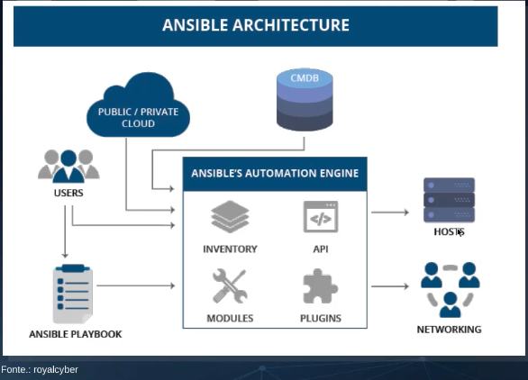
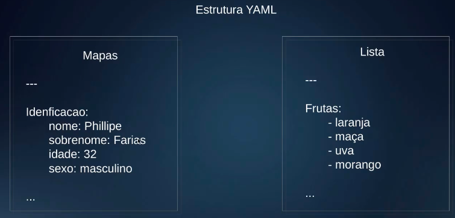
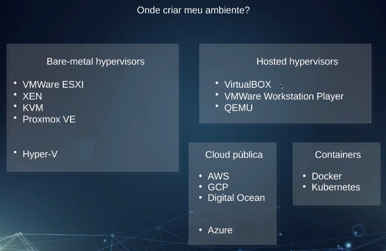
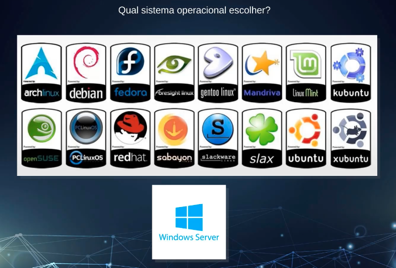
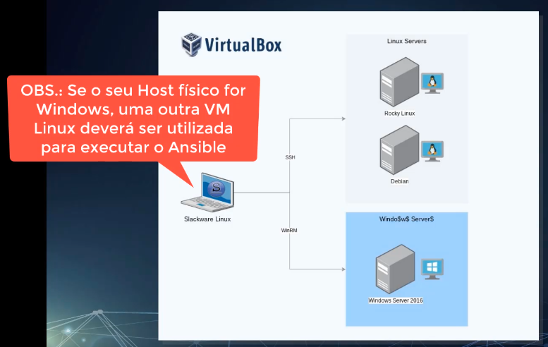
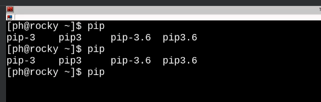
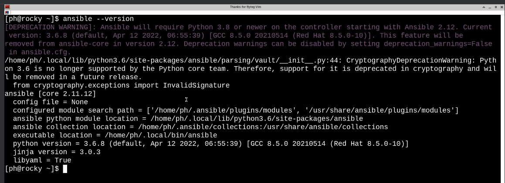
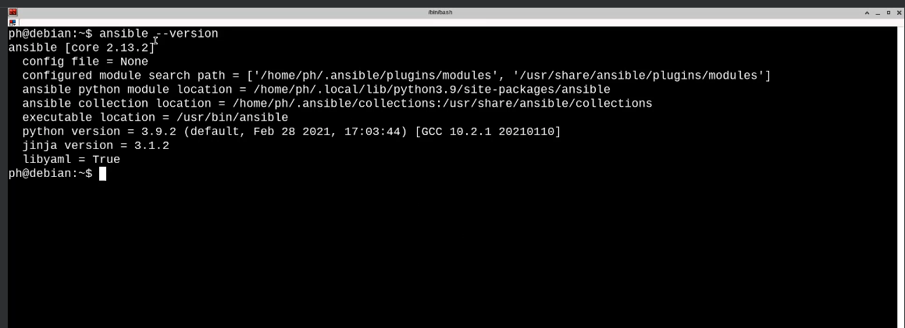
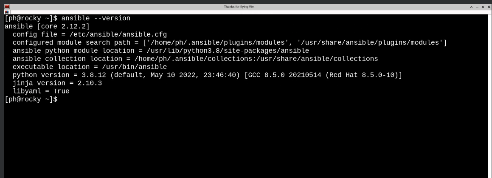

# Udemy - Ansible para SysAdmin

### **Instrutor**: Phillipe Farias
### **Linkedin**: [Perfil do LinkedIn](https://www.linkedin.com/in/phillipefarias/overlay/about-this-profile/?lipi=urn%3Ali%3Apage%3Ad_flagship3_profile_view_base%3BPtMzH14qTjigHbvNZ3iQ6Q%3D%3D)
### **Página do curso na Udemy**: [Link para página do curso](https://www.udemy.com/course/ansible-para-sysadmin/?couponCode=ST11MT91624A)
### **Pasta Google Drive Treinamento**: [Link para pasta do curso](https://drive.google.com/drive/folders/1ywcCxGLRNvVvXWHoaUsbqN4OpvNxFlCG?usp=drive_link)
### **Início**: 16/09/2024
### **Término**: 

---

## Dia 01

---

## Seção 1: Introdução ao Treinamento

### Introdução ao Treinamento

Grupo Telegram: [Link para página do grupo no Telegram](https://t.me/+SBk6LHKdpzeMLiWp)

### Requisitos Técnicos

- Nativamente o Ansible roda apenas em Linux
- Recomendação treinamento Linux: [Administração de Sistemas GNU/Linux: Fundamentos e Prática](https://www.udemy.com/course/adm-so-gnulinux/?referralCode=58F8BE46FFB066C7811A&couponCode=ST11MT91624A)
- Recomendação treinamento VirtualBox: [VirtualBox: Craindo laboratórios com máquinas virtuais](https://www.udemy.com/course/vboxlabs/?referralCode=69393EE188E9A32B5C9B)
- Antes de querer automatizar alguma tarefa ou serviço, aprenda a fazer de forma manual
- Ambientes Windows eu consigo gerencia-los

## Seção 2: Introdução ao Ansible

### O que é Ansible

- **Origem do Nome**: Em ficção científica, Ansible é uma forma de comunicação superlumínica, inicialmente proposta por Ursula K. Le Guin em seu livro _Rocannon's World_ de 1966.
- **Ferramenta de Automação**: Ansible é uma ferramenta de automação de código aberto para gestão de configuração, provisionamento e orquestração.
- **Desenvolvedor**: Criada por Michael DeHaan e mantida pela Red Hat.

### Os Quatro Pilares do Ansible

1. **Gerenciamento de Mudanças**
   - **Idempotência**: As tarefas são idempotentes, ou seja, não serão executadas novamente se o estado desejado já foi alcançado.
   - **Estado do Sistema**: Mantém o estado atual da máquina, garantindo que as configurações sejam aplicadas conforme necessário.
   - **Versões de Aplicações**: Permite manter o ambiente rodando com versões específicas das aplicações.
   - **Alertas de Mudanças**: Detecta e alerta sobre alterações no ambiente, permitindo reverter para uma versão anterior se necessário.

2. **Provisionamento**
   - **Configuração**: Define e aplica configurações em servidores e dispositivos.
   - **Instalação**: Automatiza a instalação de software e dependências.
   - **Preparação**: Prepara o ambiente para execução de aplicações.
   - **Alteração do Estado do Sistema**: Modifica o estado do sistema conforme necessário para atender aos requisitos de configuração.

3. **Automação**
   - **Execução de Tarefas**: Automatiza a execução de tarefas repetitivas e complexas.
   - **Ordenação de Tarefas**: Define a ordem de execução das tarefas (playbooks).
   - **Decisões**: Toma decisões baseadas em condições definidas (handlers e conditionals).
   - **Tarefas Ad-hoc**: Permite a execução de comandos e tarefas pontuais sem a necessidade de playbooks.

4. **Orquestração**
   - **Múltiplos Servidores**: Gerencia e coordena a configuração de múltiplos servidores simultaneamente.
   - **Múltiplas Aplicações**: Orquestra a implantação e configuração de várias aplicações.
   - **Diferentes Tarefas**: Coordena a execução de diferentes tarefas em sequência ou em paralelo.
   - **Ambiente Híbrido**: Suporta a gestão de ambientes híbridos, incluindo nuvem pública, privada e infraestrutura on-premises.

### Por que Ansible?

Além do Ansible, encontramos no mercado diversas ferramentas que se propõe a fazer o mesmo, que é a **Gestão de Configuração**, dentre as quais podemos citar:

1. **Puppet**: Uma ferramenta amplamente utilizada para automatizar a gestão de infraestrutura e garantir que os sistemas estejam configurados corretamente.
2. **Chef**: Focada em automação de infraestrutura, permite a configuração e gerenciamento de servidores em grande escala.
3. **SaltStack**: Conhecida por sua velocidade e escalabilidade, é usada para automação de TI e orquestração de infraestrutura.
4. **CFEngine**: Uma das ferramentas mais antigas, é conhecida por sua eficiência e capacidade de gerenciar grandes quantidades de servidores.
5. **Terraform**: Embora seja mais conhecida como uma ferramenta de infraestrutura como código (IaC), também pode ser usada para gestão de configuração, especialmente em ambientes de nuvem.

Essas ferramentas ajudam a automatizar e gerenciar a configuração de sistemas, garantindo consistência e eficiência.

Por que escolher o Ansible: ele tem várias vantagens que o tornam uma escolha popular para gestão de configuração:

1. **Simplicidade**: O Ansible usa uma linguagem simples baseada em YAML para definir configurações, o que facilita a leitura e a escrita dos playbooks, mesmo para quem não tem muita experiência em programação.

2. **Sem Agentes**: Diferente de algumas outras ferramentas, o Ansible não requer a instalação de agentes nos nós gerenciados. Ele se comunica via SSH, o que simplifica a configuração e a manutenção.

3. **Comunidade Ativa**: O Ansible tem uma comunidade grande e ativa, o que significa que há muitos recursos, tutoriais e módulos disponíveis para ajudar a resolver problemas e expandir funcionalidades.

4. **Flexibilidade**: Pode ser usado para uma ampla gama de tarefas, desde a configuração de servidores até a orquestração de aplicações complexas e a automação de tarefas de TI.

5. **Integração com Outras Ferramentas**: O Ansible se integra bem com outras ferramentas de DevOps e infraestrutura, como Docker, Kubernetes, e serviços de nuvem como AWS, Azure e Google Cloud.

### Arquitetura & Funcionamento do Ansible

Documentação oficial do Ansible [Link para página da documentação oficial do Ansible](https://docs.ansible.com/)

#### Representação gráfica da Arquitetura do Ansible



#### Como ele funciona?

- **Desenvolvimento**
  - **Desenvolvido em Python**: O Ansible é escrito em Python, o que significa que você precisa ter Python instalado no seu sistema para utilizá-lo.
    - **Versões Suportadas**: Python 3.5 ou superior, ou Python 2.7.
    - **Localização do Interpretador**: Por padrão, o Ansible procura o interpretador Python em **/usr/bin/python**. Se o Python estiver em outro local, você pode configurar o caminho usando a variável **ansible_interpreter**.

- **Métodos de Comunicação e Autenticação**
  - **Comunicação**
    - **Comunicação via SSH**: O Ansible utiliza o SSH para se comunicar com seus targets (servidores Unix Like, roteadores, switches, etc.). Isso elimina a necessidade de instalar agentes nos nós gerenciados.
    - **Comunicação via WinRM**: Para servidores Microsoft Windows, o Ansible usa o serviço WinRM (Windows Remote Management) para comunicação.

  - **Autenticação**
    - **Usuário e Senha**: O Ansible pode autenticar usando um nome de usuário e senha. Ele também suporta autenticação via LDAP e Kerberos.
    - **Chave SSH**: Para servidores Linux, a autenticação pode ser feita usando chaves SSH, o que é considerado mais seguro e conveniente do que senhas.

---

## Dia 02

---

### Introdução a linguagem YAML

#### YAML, o que é?

- Yet another Markup Language ou YAML Ain't markup language
- Linguagem de serialização de dados
- Amplamente utilizada em arquivos de configuração
- Conhecida pela simplicidade e legibilidade
- Usa recuo no estilo Python para indicar hierarquia e alinhamento
- _**ATENÇÃO: É necessário utilizar espaços em branco pois caracteres de tabulação não são permitidos**_

YAML Ain't Markup Language version 1.2 Revision 1.2.2 (2021-10-01) [Link para página oficial da versão](https://yaml.org/spec/1.2.2/)

#### Estrutura YAML

- YAML inclui funcionalidades de várias linguagens como Perl, C, XML e HTML
- Arquivos YAML têm a extensão "**.yml**" ou "**.yaml**"
- Estruturados em formato de **mapas** ou **listas**
  - **Mapas**:
    - Associam pares de chave-valor
    - Cada chave deve ser única e a ordem das chaves não importa
  - **Listas**:
    - Contém valores em uma ordem específica
    - Cada item da lista começa com um traço (-) seguido de um espaço
    - Itens da lista são separados por um recuo

Documentação do YAML - Ansible [Link para página documentação YAML no Ansible](https://docs.ansible.com/ansible/latest/reference_appendices/YAMLSyntax.html)

#### Exemplo de estrutura Mapas e Lista



#### Onde o YAML é usado?

- Arquivos de configuração
- Ferramentas de automação como Ansible
- Orquestração de conteiners com Kubernetes
- Definição de pipelines em CI/CD (Integração Contínua/Entrega Contínua)

---

## Dia 03

---

#### YAML Validator

Para validar nossos códigos **YAML** e evitar erros de sintaxe, podemos contar com várias ferramentas úteis. Algumas opções são:

- **PyCharm** e **Visual Studio Code**: Ambos os editores possuem plugins que ajudam na validação de **YAML**, destacando erros de sintaxe e estrutura em tempo real.
- **YAML Lint**: Uma ferramenta online simples e eficaz para validar YAML. Pode ser acessado através do site [YAML Lint](https://www.yamllint.com/).
- **YAML Checker**: Outra ferramenta online que oferece validação de sintaxe com destaque de erros e sugestões de correção. Pode ser acessado através do site [YAML Checker - The YAML Syntax Validator](https://yamlchecker.com/).
- **Online YAML Tools**: Um conjunto de ferramentas online que inclui validação de YAML, além de outras funcionalidades como conversão entre formatos e minificação. Pode ser acessado através do site [Online YAML Tools](https://onlineyamltools.com/validate-yaml)

#### Importância da Validação YAML

A validação de arquivos **YAML** é crucial para garantir que não haja erros de estrutura ou sintaxe, o que pode causar falhas na execução de scripts e configurações. Ferramentas de validação ajudam a:

- **Detectar Erros Precocemente**: Identificar e corrigir erros antes de aplicar configurações em produção.
- **Melhorar a Legibilidade**: Garantir que o código **YAML** esteja bem formatado e fácil de entender.
- **Aumentar a Confiabilidade**: Reduzir a chance de falhas devido a erros de configuração, aumentando a confiabilidade dos sistemas automatizados.

### Principais Termos e Conceitos do Ansible

- **Target**: Host gerenciado pelo Ansible, onde as tarefas serão executadas.
- **Inventory File**: Também conhecido como Inventário, é o arquivo que contém a lista de targets (hosts) do Ansible. Pode ser um arquivo estático ou dinâmico, e é utilizado para definir os hosts nos quais as tarefas serão executadas.
- **Ad-hoc**: Linha de comando do Ansible, através do binário "**/usr/bin/ansible**" usada para automatizar tarefas únicas através de um ou mais módulos. Ideal para execuções rápidas e pontuais.
- **Módulos**: Conjuntos de códigos que executam ações específicas nos targets. Podem ser usados tanto em comandos ad-hoc ou em playbooks. Exemplos incluem módulos para copiar arquivos, instalar pacotes, gerenciar serviços, etc.
- **Tasks**: Definições de ações a serem aplicadas em hosts gerenciados. Cada tarefa utiliza um módulo Ansible para realizar uma ação específica, como instalar um pacote ou reiniciar um serviço.
- **Roles**: Conjuntos reutilizáveis de automação Ansible. Uma role pode incluir tasks, handlers, variáveis, templates, arquivos e outros componentes necessários para configurar um serviço ou aplicação.
- **Playbooks**: Conjunto de instruções escritas em YAML que definem as tasks a serem executadas em hosts gerenciados. Playbooks podem incluir tasks, roles, variáveis, handlers e outras instruções.
- **Collections**: Formato de distribuição para conteúdo do Ansible, incluindo módulos, plugins, playbooks, roles e documentação. Facilita a organização e compartilhamento de conteúdo Ansible.
- **YAML**: Linguagem de serialização de dados utilizada para escrever arquivos de configuração do Ansible, como playbooks, tasks e inventory files.

#### Pontos Adicionais

- **Handlers**: Tarefas especiais que são executadas em resposta a notificações de outras tasks. São usadas para ações que devem ocorrer apenas quando há mudanças, como reiniciar um serviço após uma atualização.
- **Templates**: Arquivos que contêm variáveis e são processados pelo Ansible para gerar arquivos de configuração dinâmicos. Utilizam a linguagem de template Jinja2.
- **Vars**: Variáveis que podem ser definidas em vários níveis (playbooks, roles, inventory, etc.) e são usadas para parametrizar as tasks e playbooks.

- **Plugins**: Extensões que adicionam funcionalidades ao Ansible, como plugins de conexão, plugins de callback, plugins de lookup, entre outros.

## Seção 3: Laboratório Técnico e Primeiros Passos

### Apresentação do Laboratório

#### Onde criar meu ambiente de laboratório?



#### Qual sistema operacional escolher?



#### Ambiente utilizado pelo Instrutor



#### Realizando Testes no Laboratório

#### Considerações importantes

- **Rede**: Configure a rede em modo Bridge para que as VMs possam se comunicar diretamente com a rede local.
- **Memória**:
  - Servidores Linux: 1024 MB
  - Servidor Windows: 2048 MB
- **Templates**: Criar Templates (Snapshots) das máquinas virtuais para facilitar a recriação do ambiente, se necessário.

#### Testes de Conectividade

- **Ping**: Verifique se as VMs estão respondendo na rede. Execute o comando abaixo para cada VM:

```ping
ping 192.168.0.100
```

- **Telnet**: Verifique se a porta para SSH está habilitada nas VMs Linux. Se o SSH estiver em funcionamento e a porta padrão (22) não tiver sido alterada, execute o comando abaixo para cada VM:

```telnet
telnet 192.168.0.100 22
```

- **SSH**: Teste a comunicação SSH com as VMs Linux:

```ssh
ssh nomeusuario@192.168.0.100
```

- **Telnet (WinRM)**: Para a VM Windows, verifique se o protocolo WinRM está habilitado. Teste a comunicação na porta padrão (5985):

```telnet
telnet 192.168.0.100 5985
```

#### Adicionalmente

- **Firewall**: Certifique-se de que os firewalls das VMs estão configurados para permitir o tráfego nas portas necessárias (22 para SSH e 5985 para WinRM).
- **Hosts File**: Adicione entradas no arquivo `/etc/hosts` (ou `C:\Windows\System32\drivers\etc\hosts` no Windows) para facilitar a resolução de nomes das VMs.

---

## Dia 04

---

### Autenticação por Chaves SSH

Para que nosso treinamento esteja em conformidade com as melhores práticas, utilizaremos chaves SSH para realizar a autenticação entre nossas máquinas. A seguir, demonstraremos como criar e distribuir essas chaves.

#### Criação da Chave SSH

Execute o comando abaixo para gerar um par de chaves SSH:

```bash
ssh-keygen -b 2048 -t rsa -f ~/.ssh/ansible-key
```

Isso criará uma chave privada chamada **ansible-key** e uma chave pública chamada **ansible-key.pub**, localizadas na pasta **/home/nomeusuario/.ssh/**.

#### Cópia da Chave SSH

Para copiar a chave pública para as máquinas que iremos gerenciar, utilize o comando:

```bash
ssh-copy-id -i ~/.ssh/ansible-key.pub nomeusuario@192.168.0.100
```

Repita este comando para cada host de destino.

#### Conectando aos Hosts de Destino

Após copiar a chave pública para os hosts de destino, você pode se conectar a eles usando o comando:

```bash
ssh -i ~/.ssh/ansible-key nomeusuario@192.168.0.100
```

#### Simplificando a Conexão SSH

Para evitar a necessidade de digitar o parâmetro `-i nome da chave` toda vez que se conectar, você pode adicionar a chave a um arquivo de configuração SSH. Crie ou edite o arquivo **config** na pasta **/home/nomeusuario/.ssh** e adicione a seguinte configuração:

```text
Host 192.168.0.*
    IdentityFile ~/.ssh/ansible-key
```

Com isso, você poderá se conectar aos hosts sem especificar a chave:

```bash
ssh nomeusuario@192.168.0.100
```

### Considerações Adicionais

- **Permissões de Arquivo**: Certifique-se de que as permissões dos arquivos de chave estão corretas. A chave privada deve ter permissões **600**:

    ```bash
    chmod 600 ~/.ssh/ansible-key
    ```

- **Configuração do SSH no Servidor**: Verifique se o servidor SSH está configurado para aceitar autenticação por chave pública. No arquivo **/etc/ssh/sshd_config**, as seguintes linhas devem estar presentes e descomentadas:

    ```text
    PubkeyAuthentication yes
    AuthorizedKeysFile .ssh/authorized_keys
    ```

- **Reiniciar o Serviço SSH**: Após qualquer alteração no arquivo de configuração do SSH, reinicie o serviço:

    ```bash
    sudo systemctl restart sshd
    ```

### Instalação do Ansible

O Ansible deverá estar instalado apenas na máquina que será utilizada para rodar nossos `Playbooks`, ou seja, na máquina que será o nó master do Ansible.

Temos três formas de fazer a instalação:

- Instalação via PIP (gerenciador de dependências de pacotes do Python)
- Instalação via apt (gerenciador de pacotes para distribuições Debian)
- Instalação via yum (gerenciador de pacotes para distribuições Red Hat)

Na documentação oficial do Ansible podemos encontrar estas e outras formas de instalação. Esta documentação pode ser acessado através do site [Ansible Community Documentation](https://docs.ansible.com/ansible/latest/installation_guide/intro_installation.html).

#### Instalação via PIP

Neste exemplo faremos a instalação em uma distribuição Red Hat, optando pelo Python 3: 

```bash
sudo yum install python3-pip
```

Ao finalizar a instalação podemos conferir executando o seguinte comando:

```bash
pip
```

O retorno deste comando deve ser alguma coisa parecida com a imagem abaixo:



Na sequência faremos a instalação do `pip3` executando o seguinte comando:

```bash
sudo pip3 install pip --upgrade
```

Isso fará com que o `pip` seja instalado com sua última versão e após a conclusão da instalação podemos conferir executando o seguinte comando:

```bash
pip3 --version
```

Agora podemos partir para a instalação do Ansible propriamente dito, para isso devemos executar o seguinte comando:

```bash
sudo pip3 install ansible
```

Após a conclusão da instalação podemos conferir executando o seguinte comando:

```bash
ansible --version
```

O retorno deste comando deve ser alguma coisa parecida com a imagem abaixo:



**Obs.**: Quando o Ansible é instalado via `pip`, por padrão ele não cria o arquivo `/etc/ansible/ansible.cfg`, devendo ser criado manualmente.

Instalação realizada, podemos fazer a atualização do Ansible, executando o seguinte comando:

```bash
pip install ansible --upgrade
```

Isso fará com que o Ansible seja autalizado e podemos fazer a remoção do Ansible executando o seguinte comando:

```bash
pip3 uninstall ansible
```

#### Instalação via Gerenciador de Dependências (apt e yum)

**Instalação via apt**: executando o seguinte comando:

```bash
sudo apt install ansible
```

Após a conclusão da instalação podemos conferir executando o seguinte comando:

```bash
ansible --version
```

O retorno deste comando deve ser alguma coisa parecida com a imagem abaixo:



**Instalação via yum**: executando os seguintes comandos:

```bash
sudo yum install epel-release
sudo yum update
sudo yum install ansible
```

Após a conclusão da instalação podemos conferir executando o seguinte comando:

```bash
ansible --version
```

O retorno deste comando deve ser alguma coisa parecida com a imagem abaixo:



---

## Dia 05 - coming soon

---
