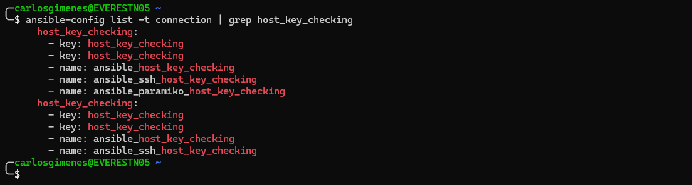

# Udemy - Ansible para SysAdmin

### **Instrutor**: Phillipe Farias
### **Linkedin**: [Perfil do LinkedIn](https://www.linkedin.com/in/phillipefarias/overlay/about-this-profile/?lipi=urn%3Ali%3Apage%3Ad_flagship3_profile_view_base%3BPtMzH14qTjigHbvNZ3iQ6Q%3D%3D)
### **Página do curso na Udemy**: [Link para página do curso](https://www.udemy.com/course/ansible-para-sysadmin/?couponCode=ST11MT91624A)
### **Pasta Google Drive Treinamento**: [Link para pasta do curso](https://drive.google.com/drive/folders/1ywcCxGLRNvVvXWHoaUsbqN4OpvNxFlCG?usp=drive_link)
### **Início**: 16/09/2024
### **Término**: 

---

## Dia 01

---

## Seção 1: Introdução ao Treinamento

### Introdução ao Treinamento

Grupo Telegram: [Link para página do grupo no Telegram](https://t.me/+SBk6LHKdpzeMLiWp)

### Requisitos Técnicos

- Nativamente o Ansible roda apenas em Linux
- Recomendação treinamento Linux: [Administração de Sistemas GNU/Linux: Fundamentos e Prática (Udemy)](https://www.udemy.com/course/adm-so-gnulinux/?referralCode=58F8BE46FFB066C7811A&couponCode=ST11MT91624A)
- Recomendação treinamento VirtualBox: [VirtualBox: Craindo laboratórios com máquinas virtuais (Udemy)](https://www.udemy.com/course/vboxlabs/?referralCode=69393EE188E9A32B5C9B)
- Antes de querer automatizar alguma tarefa ou serviço, aprenda a fazer de forma manual
- Ambientes Windows eu consigo gerencia-los

## Seção 2: Introdução ao Ansible

### O que é Ansible

- **Origem do Nome**: Em ficção científica, Ansible é uma forma de comunicação superlumínica, inicialmente proposta por Ursula K. Le Guin em seu livro _Rocannon's World_ de 1966.
- **Ferramenta de Automação**: Ansible é uma ferramenta de automação de código aberto para gestão de configuração, provisionamento e orquestração.
- **Desenvolvedor**: Criada por Michael DeHaan e mantida pela Red Hat.

### Os Quatro Pilares do Ansible

1. **Gerenciamento de Mudanças**
   - **Idempotência**: As tarefas são idempotentes, ou seja, não serão executadas novamente se o estado desejado já foi alcançado.
   - **Estado do Sistema**: Mantém o estado atual da máquina, garantindo que as configurações sejam aplicadas conforme necessário.
   - **Versões de Aplicações**: Permite manter o ambiente rodando com versões específicas das aplicações.
   - **Alertas de Mudanças**: Detecta e alerta sobre alterações no ambiente, permitindo reverter para uma versão anterior se necessário.

2. **Provisionamento**
   - **Configuração**: Define e aplica configurações em servidores e dispositivos.
   - **Instalação**: Automatiza a instalação de software e dependências.
   - **Preparação**: Prepara o ambiente para execução de aplicações.
   - **Alteração do Estado do Sistema**: Modifica o estado do sistema conforme necessário para atender aos requisitos de configuração.

3. **Automação**
   - **Execução de Tarefas**: Automatiza a execução de tarefas repetitivas e complexas.
   - **Ordenação de Tarefas**: Define a ordem de execução das tarefas (playbooks).
   - **Decisões**: Toma decisões baseadas em condições definidas (handlers e conditionals).
   - **Tarefas Ad-hoc**: Permite a execução de comandos e tarefas pontuais sem a necessidade de playbooks.

4. **Orquestração**
   - **Múltiplos Servidores**: Gerencia e coordena a configuração de múltiplos servidores simultaneamente.
   - **Múltiplas Aplicações**: Orquestra a implantação e configuração de várias aplicações.
   - **Diferentes Tarefas**: Coordena a execução de diferentes tarefas em sequência ou em paralelo.
   - **Ambiente Híbrido**: Suporta a gestão de ambientes híbridos, incluindo nuvem pública, privada e infraestrutura on-premises.

### Por que Ansible?

Além do Ansible, encontramos no mercado diversas ferramentas que se propõe a fazer o mesmo, que é a **Gestão de Configuração**, dentre as quais podemos citar:

1. **Puppet**: Uma ferramenta amplamente utilizada para automatizar a gestão de infraestrutura e garantir que os sistemas estejam configurados corretamente.
2. **Chef**: Focada em automação de infraestrutura, permite a configuração e gerenciamento de servidores em grande escala.
3. **SaltStack**: Conhecida por sua velocidade e escalabilidade, é usada para automação de TI e orquestração de infraestrutura.
4. **CFEngine**: Uma das ferramentas mais antigas, é conhecida por sua eficiência e capacidade de gerenciar grandes quantidades de servidores.
5. **Terraform**: Embora seja mais conhecida como uma ferramenta de infraestrutura como código (IaC), também pode ser usada para gestão de configuração, especialmente em ambientes de nuvem.

Essas ferramentas ajudam a automatizar e gerenciar a configuração de sistemas, garantindo consistência e eficiência.

Por que escolher o Ansible: ele tem várias vantagens que o tornam uma escolha popular para gestão de configuração:

1. **Simplicidade**: O Ansible usa uma linguagem simples baseada em YAML para definir configurações, o que facilita a leitura e a escrita dos playbooks, mesmo para quem não tem muita experiência em programação.

2. **Sem Agentes**: Diferente de algumas outras ferramentas, o Ansible não requer a instalação de agentes nos nós gerenciados. Ele se comunica via SSH, o que simplifica a configuração e a manutenção.

3. **Comunidade Ativa**: O Ansible tem uma comunidade grande e ativa, o que significa que há muitos recursos, tutoriais e módulos disponíveis para ajudar a resolver problemas e expandir funcionalidades.

4. **Flexibilidade**: Pode ser usado para uma ampla gama de tarefas, desde a configuração de servidores até a orquestração de aplicações complexas e a automação de tarefas de TI.

5. **Integração com Outras Ferramentas**: O Ansible se integra bem com outras ferramentas de DevOps e infraestrutura, como Docker, Kubernetes, e serviços de nuvem como AWS, Azure e Google Cloud.

### Arquitetura & Funcionamento do Ansible

Documentação oficial do Ansible [Link para página da documentação oficial do Ansible](https://docs.ansible.com/)

#### Representação gráfica da Arquitetura do Ansible


#### Como ele funciona?

- **Desenvolvimento**
  - **Desenvolvido em Python**: O Ansible é escrito em Python, o que significa que você precisa ter Python instalado no seu sistema para utilizá-lo.
    - **Versões Suportadas**: Python 3.5 ou superior, ou Python 2.7.
    - **Localização do Interpretador**: Por padrão, o Ansible procura o interpretador Python em **/usr/bin/python**. Se o Python estiver em outro local, você pode configurar o caminho usando a variável **ansible_interpreter**.

- **Métodos de Comunicação e Autenticação**
  - **Comunicação**
    - **Comunicação via SSH**: O Ansible utiliza o SSH para se comunicar com seus targets (servidores Unix Like, roteadores, switches, etc.). Isso elimina a necessidade de instalar agentes nos nós gerenciados.
    - **Comunicação via WinRM**: Para servidores Microsoft Windows, o Ansible usa o serviço WinRM (Windows Remote Management) para comunicação.

  - **Autenticação**
    - **Usuário e Senha**: O Ansible pode autenticar usando um nome de usuário e senha. Ele também suporta autenticação via LDAP e Kerberos.
    - **Chave SSH**: Para servidores Linux, a autenticação pode ser feita usando chaves SSH, o que é considerado mais seguro e conveniente do que senhas.

---

## Dia 02

---

### Introdução a linguagem YAML

#### YAML, o que é?

- Yet another Markup Language ou YAML Ain't markup language
- Linguagem de serialização de dados
- Amplamente utilizada em arquivos de configuração
- Conhecida pela simplicidade e legibilidade
- Usa recuo no estilo Python para indicar hierarquia e alinhamento
- _**ATENÇÃO: É necessário utilizar espaços em branco pois caracteres de tabulação não são permitidos**_

YAML Ain't Markup Language version 1.2 Revision 1.2.2 (2021-10-01) [Link para página oficial da versão](https://yaml.org/spec/1.2.2/)

#### Estrutura YAML

- YAML inclui funcionalidades de várias linguagens como Perl, C, XML e HTML
- Arquivos YAML têm a extensão "**.yml**" ou "**.yaml**"
- Estruturados em formato de **mapas** ou **listas**
  - **Mapas**:
    - Associam pares de chave-valor
    - Cada chave deve ser única e a ordem das chaves não importa
  - **Listas**:
    - Contém valores em uma ordem específica
    - Cada item da lista começa com um traço (-) seguido de um espaço
    - Itens da lista são separados por um recuo

Documentação do YAML - Ansible [Link para página documentação YAML no Ansible](https://docs.ansible.com/ansible/latest/reference_appendices/YAMLSyntax.html)

#### Exemplo de estrutura Mapas e Lista


#### Onde o YAML é usado?

- Arquivos de configuração
- Ferramentas de automação como Ansible
- Orquestração de conteiners com Kubernetes
- Definição de pipelines em CI/CD (Integração Contínua/Entrega Contínua)

---

## Dia 03

---

#### YAML Validator

Para validar nossos códigos **YAML** e evitar erros de sintaxe, podemos contar com várias ferramentas úteis. Algumas opções são:

- **PyCharm** e **Visual Studio Code**: Ambos os editores possuem plugins que ajudam na validação de **YAML**, destacando erros de sintaxe e estrutura em tempo real.
- **YAML Lint**: Uma ferramenta online simples e eficaz para validar YAML. Pode ser acessado através do site [YAML Lint](https://www.yamllint.com/).
- **YAML Checker**: Outra ferramenta online que oferece validação de sintaxe com destaque de erros e sugestões de correção. Pode ser acessado através do site [YAML Checker - The YAML Syntax Validator](https://yamlchecker.com/).
- **Online YAML Tools**: Um conjunto de ferramentas online que inclui validação de YAML, além de outras funcionalidades como conversão entre formatos e minificação. Pode ser acessado através do site [Online YAML Tools](https://onlineyamltools.com/validate-yaml)

#### Importância da Validação YAML

A validação de arquivos **YAML** é crucial para garantir que não haja erros de estrutura ou sintaxe, o que pode causar falhas na execução de scripts e configurações. Ferramentas de validação ajudam a:

- **Detectar Erros Precocemente**: Identificar e corrigir erros antes de aplicar configurações em produção.
- **Melhorar a Legibilidade**: Garantir que o código **YAML** esteja bem formatado e fácil de entender.
- **Aumentar a Confiabilidade**: Reduzir a chance de falhas devido a erros de configuração, aumentando a confiabilidade dos sistemas automatizados.

### Principais Termos e Conceitos do Ansible

- **Target**: Host gerenciado pelo Ansible, onde as tarefas serão executadas.
- **Inventory File**: Também conhecido como Inventário, é o arquivo que contém a lista de targets (hosts) do Ansible. Pode ser um arquivo estático ou dinâmico, e é utilizado para definir os hosts nos quais as tarefas serão executadas.
- **Ad-hoc**: Linha de comando do Ansible, através do binário "**/usr/bin/ansible**" usada para automatizar tarefas únicas através de um ou mais módulos. Ideal para execuções rápidas e pontuais.
- **Módulos**: Conjuntos de códigos que executam ações específicas nos targets. Podem ser usados tanto em comandos ad-hoc ou em playbooks. Exemplos incluem módulos para copiar arquivos, instalar pacotes, gerenciar serviços, etc.
- **Tasks**: Definições de ações a serem aplicadas em hosts gerenciados. Cada tarefa utiliza um módulo Ansible para realizar uma ação específica, como instalar um pacote ou reiniciar um serviço.
- **Roles**: Conjuntos reutilizáveis de automação Ansible. Uma role pode incluir tasks, handlers, variáveis, templates, arquivos e outros componentes necessários para configurar um serviço ou aplicação.
- **Playbooks**: Conjunto de instruções escritas em YAML que definem as tasks a serem executadas em hosts gerenciados. Playbooks podem incluir tasks, roles, variáveis, handlers e outras instruções.
- **Collections**: Formato de distribuição para conteúdo do Ansible, incluindo módulos, plugins, playbooks, roles e documentação. Facilita a organização e compartilhamento de conteúdo Ansible.
- **YAML**: Linguagem de serialização de dados utilizada para escrever arquivos de configuração do Ansible, como playbooks, tasks e inventory files.

#### Pontos Adicionais

- **Handlers**: Tarefas especiais que são executadas em resposta a notificações de outras tasks. São usadas para ações que devem ocorrer apenas quando há mudanças, como reiniciar um serviço após uma atualização.
- **Templates**: Arquivos que contêm variáveis e são processados pelo Ansible para gerar arquivos de configuração dinâmicos. Utilizam a linguagem de template Jinja2.
- **Vars**: Variáveis que podem ser definidas em vários níveis (playbooks, roles, inventory, etc.) e são usadas para parametrizar as tasks e playbooks.

- **Plugins**: Extensões que adicionam funcionalidades ao Ansible, como plugins de conexão, plugins de callback, plugins de lookup, entre outros.

## Seção 3: Laboratório Técnico e Primeiros Passos

### Apresentação do Laboratório

#### Onde criar meu ambiente de laboratório?


#### Qual sistema operacional escolher?


#### Ambiente utilizado pelo Instrutor


#### Realizando Testes no Laboratório

#### Considerações importantes

- **Rede**: Configure a rede em modo Bridge para que as VMs possam se comunicar diretamente com a rede local.
- **Memória**:
  - Servidores Linux: 1024 MB
  - Servidor Windows: 2048 MB
- **Templates**: Criar Templates (Snapshots) das máquinas virtuais para facilitar a recriação do ambiente, se necessário.

#### Testes de Conectividade

- **Ping**: Verifique se as VMs estão respondendo na rede. Execute o comando abaixo para cada VM:

```ping
ping 192.168.0.100
```

- **Telnet**: Verifique se a porta para SSH está habilitada nas VMs Linux. Se o SSH estiver em funcionamento e a porta padrão (22) não tiver sido alterada, execute o comando abaixo para cada VM:

```telnet
telnet 192.168.0.100 22
```

- **SSH**: Teste a comunicação SSH com as VMs Linux:

```ssh
ssh nomeusuario@192.168.0.100
```

- **Telnet (WinRM)**: Para a VM Windows, verifique se o protocolo WinRM está habilitado. Teste a comunicação na porta padrão (5985):

```telnet
telnet 192.168.0.100 5985
```

#### Adicionalmente

- **Firewall**: Certifique-se de que os firewalls das VMs estão configurados para permitir o tráfego nas portas necessárias (22 para SSH e 5985 para WinRM).
- **Hosts File**: Adicione entradas no arquivo `/etc/hosts` (ou `C:\Windows\System32\drivers\etc\hosts` no Windows) para facilitar a resolução de nomes das VMs.

---

## Dia 04

---

### Autenticação por Chaves SSH

Para que nosso treinamento esteja em conformidade com as melhores práticas, utilizaremos chaves SSH para realizar a autenticação entre nossas máquinas. A seguir, demonstraremos como criar e distribuir essas chaves.

#### Criação da Chave SSH

Execute o comando abaixo para gerar um par de chaves SSH:

```bash
ssh-keygen -b 2048 -t rsa -f ~/.ssh/ansible-key
```

Isso criará uma chave privada chamada **ansible-key** e uma chave pública chamada **ansible-key.pub**, localizadas na pasta **/home/nomeusuario/.ssh/**.

#### Cópia da Chave SSH

Para copiar a chave pública para as máquinas que iremos gerenciar, utilize o comando:

```bash
ssh-copy-id -i ~/.ssh/ansible-key.pub nomeusuario@192.168.0.100
```

Repita este comando para cada host de destino.

#### Conectando aos Hosts de Destino

Após copiar a chave pública para os hosts de destino, você pode se conectar a eles usando o comando:

```bash
ssh -i ~/.ssh/ansible-key nomeusuario@192.168.0.100
```

#### Simplificando a Conexão SSH

Para evitar a necessidade de digitar o parâmetro `-i nome da chave` toda vez que se conectar, você pode adicionar a chave a um arquivo de configuração SSH. Crie ou edite o arquivo **config** na pasta **/home/nomeusuario/.ssh** e adicione a seguinte configuração:

```text
Host 192.168.0.*
    IdentityFile ~/.ssh/ansible-key
```

Com isso, você poderá se conectar aos hosts sem especificar a chave:

```bash
ssh nomeusuario@192.168.0.100
```

### Considerações Adicionais

- **Permissões de Arquivo**: Certifique-se de que as permissões dos arquivos de chave estão corretas. A chave privada deve ter permissões **600**:

    ```bash
    chmod 600 ~/.ssh/ansible-key
    ```

- **Configuração do SSH no Servidor**: Verifique se o servidor SSH está configurado para aceitar autenticação por chave pública. No arquivo **/etc/ssh/sshd_config**, as seguintes linhas devem estar presentes e descomentadas:

    ```text
    PubkeyAuthentication yes
    AuthorizedKeysFile .ssh/authorized_keys
    ```

- **Reiniciar o Serviço SSH**: Após qualquer alteração no arquivo de configuração do SSH, reinicie o serviço:

    ```bash
    sudo systemctl restart sshd
    ```

### Instalação do Ansible

O Ansible deve estar instalado apenas na máquina que será utilizada para rodar nossos `Playbooks`, ou seja, na máquina que será o nó master do Ansible.

Temos três formas de fazer a instalação:

- Instalação via PIP (gerenciador de dependências de pacotes do Python)
- Instalação via apt (gerenciador de pacotes para distribuições Debian)
- Instalação via yum (gerenciador de pacotes para distribuições Red Hat)

Na documentação oficial do Ansible, podemos encontrar estas e outras formas de instalação. Esta documentação pode ser acessada através do site [Ansible Community Documentation](https://docs.ansible.com/ansible/latest/installation_guide/intro_installation.html).

#### Instalação via PIP

Neste exemplo, faremos a instalação em uma distribuição Red Hat, optando pelo Python 3:

1. **Instalar o PIP**:

    ```bash
    sudo yum install python3-pip
    ```

    Após a instalação, verifique a versão do PIP:

    ```bash
    pip3 --version
    ```

    

2. **Atualizar o PIP**:

    ```bash
    sudo pip3 install pip --upgrade
    ```

3. **Instalar o Ansible**:

    ```bash
    sudo pip3 install ansible
    ```

    Verifique a instalação do Ansible:

    ```bash
    ansible --version
    ```

    

    **Obs.**: Quando o Ansible é instalado via `pip`, por padrão ele não cria o arquivo `/etc/ansible/ansible.cfg`, devendo ser criado manualmente.

4. **Atualizar o Ansible**:

    ```bash
    sudo pip3 install ansible --upgrade
    ```

5. **Desinstalar o Ansible**:

    ```bash
    sudo pip3 uninstall ansible
    ```

#### Instalação via Gerenciador de Pacotes (apt e yum)

1. **Instalação via apt**:

    ```bash
    sudo apt update
    sudo apt install ansible
    ```

    Verifique a instalação do Ansible:

    ```bash
    ansible --version
    ```

    

    **Desinstalação via apt**:

    ```bash
    sudo apt remove --purge ansible
    sudo apt autoremove
    sudo apt update
    ```

2. **Instalação via yum**:

    ```bash
    sudo yum install epel-release
    sudo yum update
    sudo yum install ansible
    ```

    Verifique a instalação do Ansible:

    ```bash
    ansible --version
    ```

    

    **Desinstalação via yum**:

    ```bash
    sudo yum remove ansible
    sudo yum autoremove
    sudo yum update
    ```

---

## Dia 05

---

## Seção 4: Conhecendo o ansible.cfg

### Introdução ao ansible.cfg

Página para documentação do arquivo ansible.cfg [Link para página da documentação arquivo ansible.cfg](https://docs.ansible.com/ansible/latest/installation_guide/intro_configuration.html)

#### Principais Itens do Arquivo ansible.cfg

- **Principal Arquivo de Configuração**: O `ansible.cfg` é o principal arquivo de configuração do Ansible, formatado como um arquivo INI.
- **Criação e Modificação**: Pode ser criado manualmente ou através do utilitário `ansible-config`, que permite criar, modificar e consultar configurações.
- **Localização Padrão**: Por padrão, está localizado em `/etc/ansible/ansible.cfg`.
- **Configurações Padrão**: Se nenhum arquivo de configuração for localizado, as opções padrão do Ansible serão aplicadas.

**Atenção**: Dependendo da forma de instalação do Ansible e/ou da distribuição Linux utilizada, o arquivo `/etc/ansible/ansible.cfg` pode ou não ser criado automaticamente.

#### Ordem de Prioridade e Interpretação do Arquivo ansible.cfg

Quando executamos uma linha ad-hoc ou um playbook, o Ansible segue uma ordem de prioridade para localizar o arquivo `ansible.cfg`:

1. **$ANSIBLE_CONFIG**: Procura pelo `ansible.cfg` na variável de ambiente `$ANSIBLE_CONFIG`. Se encontrado, utiliza o caminho especificado.
2. **./ansible.cfg**: Procura pelo `ansible.cfg` no diretório corrente. Se encontrado, ele será utilizado.
3. **~/ansible.cfg**: Procura pelo `ansible.cfg` no diretório home do usuário. Se encontrado, ele será utilizado.
4. **/etc/ansible/ansible.cfg**: Por último, procura pelo `ansible.cfg` no diretório `/etc/ansible/`. Se encontrado, ele será utilizado.


#### Considerações de Segurança

- **Permissões de Arquivo**: Certifique-se de que o arquivo `ansible.cfg` possui permissões adequadas para evitar acesso não autorizado. Recomenda-se que apenas usuários e grupos autorizados tenham permissões de escrita.
- **Localização do Arquivo**: Tenha cuidado ao deixar o arquivo `ansible.cfg` no diretório corrente ou em locais acessíveis por múltiplos usuários. Uma má configuração pode expor seu ambiente a riscos de segurança.

#### Exemplos de Configurações Comuns

Alguns exemplos de configurações comuns que podem ser definidas no arquivo `ansible.cfg`:

```ini
[defaults]
inventory = ./hosts
remote_user = ansible
private_key_file = ~/.ssh/ansible_key
host_key_checking = False
retry_files_enabled = False

[privilege_escalation]
become = True
become_method = sudo
become_user = root
become_ask_pass = False
```

- **inventory**: Define o caminho para o arquivo de inventário.
- **remote_user**: Define o usuário remoto padrão para conexões SSH.
- **private_key_file**: Especifica o arquivo de chave privada para autenticação SSH.
- **host_key_checking**: Desabilita a verificação de chave de host SSH (não recomendado para produção).
- **retry_files_enabled**: Desabilita a criação de arquivos de retry.
- **become**: Habilita a escalada de privilégios.
- **become_method**: Define o método de escalada de privilégios (ex.: sudo).
- **become_user**: Define o usuário para escalada de privilégios.
- **become_ask_pass**: Desabilita a solicitação de senha para escalada de privilégios.

Essas configurações ajudam a personalizar o comportamento do Ansible de acordo com as necessidades do ambiente.

---

## Dia 06

---

### Conhecendo o ansible-config

Página para documentação do arquivo ansible-config [Link para página da documentação arquivo ansible-config](https://docs.ansible.com/ansible/latest/cli/ansible-config.html#ansible-config)

#### Utilitário ansible-config

- **Função**: Comando utilizado para criar e/ou alterar o arquivo `ansible.cfg`.
- **Visualização de Configurações**: Permite visualizar todas as configurações padrão aplicadas ao Ansible.
- **Sintaxe**:
  - `ansible-config [opções] [argumentos]`

#### Principais Opções

- **list**: Exibe todas as configurações disponíveis.
  - Exemplo: `$ ansible-config list`
  - **Exemplo de Retorno**:

    ```text
    ACTION_WARNINGS(default) = True
    AGGREGATE_PLUGINS(default) = True
    ALLOW_WORLD_READABLE_TMPFILES(default) = False
    ...
    ```

- **dump**: Exibe todas as configurações disponíveis e cruza com as aplicadas no arquivo `ansible.cfg`.
  - Exemplo: `$ ansible-config dump`
  - **Exemplo de Retorno**:

    ```text
    DEFAULT_ACTION_WARNINGS(default) = True
    DEFAULT_AGGREGATE_PLUGINS(default) = True
    DEFAULT_ALLOW_WORLD_READABLE_TMPFILES(default) = False
    ...
    ```

- **view**: Exibe as configurações dentro do arquivo `ansible.cfg`.
  - Exemplo: `$ ansible-config view`
  - **Exemplo de Retorno**:

    ```ini
    [defaults]
    inventory = ./hosts
    remote_user = ansible
    private_key_file = ~/.ssh/ansible_key
    host_key_checking = False
    retry_files_enabled = False

    [privilege_escalation]
    become = True
    become_method = sudo
    become_user = root
    become_ask_pass = False
    ```

- **init**: Cria um arquivo de configuração inicial.
  - Exemplo: `$ ansible-config init`
  - **Exemplo de Retorno**:

    ```text
    Configuration file written to /path/to/your/directory/ansible.cfg
    ```

#### Plugins Disponíveis no ansible.cfg

- **base**: Configurações básicas do Ansible.
- **become**: Configurações relacionadas à escalada de privilégios.
- **cache**: Configurações de cache para melhorar o desempenho.
- **callback**: Plugins de callback para personalizar a saída do Ansible.
- **cliconf**: Plugins de configuração de CLI para dispositivos de rede.
- **connection**: Configurações de conexão, como SSH e WinRM.
- **httpapi**: Plugins para interagir com APIs HTTP.
- **inventory**: Configurações relacionadas ao inventário de hosts.
- **lookup**: Plugins de lookup para buscar dados de várias fontes.
- **netconf**: Plugins para gerenciar dispositivos de rede via NETCONF.
- **shell**: Configurações para execução de comandos shell.
- **vars**: Configurações de variáveis.

---

## Dia 07

---

## Montagem do Laboratório

### Considerações de Configuração

- **Ansible Control Node (`VSC-NBK08`)** Deve ter o SSH habilitado e configurado para comunicação com os servidores Linux (`LAB-ANS-SRV01`, `LAB-ANS-SRV02`).
- **WinRM** Deve ser configurado no Windows Server (`LAB-ANS-SRV03`) para que o Ansible possa gerenciar essa máquina.
- Todos os dispositivos podem ser acessados diretamente pelo IP e estão no mesmo segmento de rede.

Em nossos estudos, além da premissa de aprender Ansible, também desejamos desenvolver uma cultura DevOps, que visa o gerenciamento, automação e colaboração entre equipes e neste sentido, seguir uma convenção de nomenclatura eficiente para nossas máquinas é fundamental. Assim seguiremos algumas boas práticas e recomendações para nemea-las, baseando-se em um modelo claro e estruturado.

### Recomendações para Nomenclatura

1. **Descritiva e Padronizada:** Cada nome de máquina deve ser descritivo, indicando seu propósito, local, função ou ambiente. Use um padrão consistente para facilitar o gerenciamento e a automação.

2. **Evite Caracteres Especiais e Espaços:** Mantenha os nomes simples, sem caracteres especiais, como `#`, `@`, `!`, ou espaços, para evitar problemas de compatibilidade com scripts e ferramentas automatizadas.

3. **Categorias Sugeridas para Nomes:**
   - **Ambiente:** Indique o ambiente em que a máquina está rodando, como `PRD` (Produção), `DEV` (Desenvolvimento), `STG` (Homologação/Stage), `QA` (Qualidade).
   - **Função:** Identifique o papel da máquina, como `WEB`, `DB`, `APP`, `SRV` (servidor genérico).
   - **Localização ou Cluster:** Se aplicável, inclua a região geográfica, datacenter ou cluster da máquina, como `USW1` (usando abreviações de regiões AWS ou Azure, por exemplo), ou `SP` para São Paulo.
   - **Número Sequencial:** Um número sequencial para distinguir máquinas semelhantes, como `01`, `02`, `03`.

### Modelo Sugerido

**[Ambiente]-[Função]-[Localização]-[Número]**

Exemplos:

- **PRD-WEB-USW1-01:** Servidor web em produção no datacenter da costa oeste dos EUA, instância 1.
- **DEV-DB-SP-02:** Servidor de banco de dados no ambiente de desenvolvimento, localizado em São Paulo, instância 2.
- **STG-APP-USW1-03:** Servidor de aplicação no ambiente de homologação, na região da costa oeste dos EUA.

### Aplicação ao Nosso Laboratório

Com base em nossa configuração de rede, adaptaremos o modelo da seguinte forma:

- **Ambiente:** Para nosso estudo, usaremos `LAB` (laboratório).
- **Função:** Especificaremos sua função como `ANS` (Ansible).
- **Localização:** Como se trata de um laboratório, omitiremos este valor e usaremos apenas `SRV` para caracterizar que se trata de um servidor.
- **Número Sequencial:** Usaremos números para diferenciar as máquinas.

**Modelo Final para nosso Labortatório:**

- **LAB-ANS-SRV01**: Control Node do Ansible
- **LAB-ANS-SRV02**: Servidor Linux
- **LAB-ANS-SRV03**: Servidor Windows

Isso manterá os nomes curtos, claros e fáceis de entender, além de flexíveis para futuras expansões.

### Layout da Rede do Laboratório

1. **Control Node (Desktop com Linux Ubuntu):**
   - **Nome da Máquina:** `VSC-NBK08`
   - **Memória RAM e CPU:** Conforme o hardware do seu desktop
   - **Disco:** Conforme o hardware do seu desktop
   - **Rede:**
     - Modo de rede: Bridge
     - IP: **192.168.0.131** (fixo)
     - Gateway: **192.168.0.1**
     - DNS: **192.168.0.1 8.8.8.8**
   - **Função no laboratório:** Control Node para o Ansible, responsável por orquestrar os servidores Linux e Windows.

2. **Servidor Linux Ubuntu (1 VM):**
   - **Nome da VM:** `LAB-ANS-SRV01`
   - **Memória RAM:** 1GB
   - **CPU:** 1 núcleo (ajustável)
   - **Disco:** 10GB (ou mais conforme necessário)
   - **Rede:**
     - Modo de rede: **Bridge**
     - IP: **192.168.0.136**
     - Gateway: **192.168.0.1**
     - DNS: **192.168.0.1 8.8.8.8**
   - **Função no laboratório:** Node para o Ansible (servidor alvo)

3. **Servidores Linux Ubuntu (1 VM):**
   - **Nome das VMs:** `LAB-ANS-SRV02`
   - **Memória RAM:** 1GB
   - **CPU:** 1 núcleo (ajustável)
   - **Disco:** 10GB (ou mais conforme necessário)
   - **Rede:**
     - Modo de rede: **Bridge**
     - IP: **192.168.0.137**
     - Gateway: **192.168.0.1**
     - DNS: **192.168.0.1 8.8.8.8**
   - **Função no laboratório:** Node para o Ansible (servidor alvo)

4. **Servidor Windows Server 2019 (1 VM):**
   - **Nome da VM:** `LAB-ANS-SRV03`
   - **Memória RAM:** 2GB
   - **CPU:** 2 núcleos (ajustável)
   - **Disco:** 30GB (ou mais conforme necessário)
   - **Rede:**
     - Modo de rede: Bridge
     - IP: **192.168.0.138**
     - Gateway: **192.168.0.1**
     - DNS: **192.168.0.1 8.8.8.8**
   - **Função no laboratório:** Node adicional para o Ansible, suportando automação de Windows.

### Topologia da Rede

- **Control Node (`VSC-NBK08`)** Orquestra as VMs Linux (`LAB-ANS-SRV01`, `LAB-ANS-SRV02`) e a VM Windows (`LAB-ANS-SRV04`).
- Todos os servidores estão na rede **192.168.0.x** e têm IPs fixos, começando a partir de **192.168.0.100**.
- O gateway é **192.168.0.1** e todos os dispositivos estão conectados via **modo Bridge** no VirtualBox, o que garante que façam parte da mesma rede local.

---

## Dia 08

---

### Download Ubuntu Server 24.04.1 LTS

Página oficial Ubuntu para Download da ISO: [Link para página Ubuntu Server 24.04.1 LTS](https://ubuntu.com/download/server/thank-you?version=24.04.1&architecture=amd64&lts=true)

#### Opções de Configuração das VMs Linux

Durante a instalação do Ubuntu Server 24.04.1 LTS, as seguintes opções foram escolhidas:

```text
Select your language            = English
Keyboard configuration          = Portuguese (Brazil)
Choose the type of installation = Ubuntu Server
Additional options              = Search for third-party drivers
Network configuration           = enp0s3 eth DHCPv4 10.0.2.15/24
Your name                       = Ansible para SysAdmin
Your server name                = lab-ans-srv01
Pick a username                 = ansible
Password                        = Minh@Senh@123
Upgrade to Ubuntu Pro           = Skip for now
SSH configuration               = Install OpenSSH server
```

### Ações Adicionais pós Instalação

1. **Configuração da Rede**: Após a instalação, ajuste a rede para o modo Bridge, pois o padrão é que ela fique em modo NAT. Em seguida, execute o script `ConfigurarRedeComIpFixo.sh` para configurar o endereço de rede desejado. Certifique-se de que o script está configurado corretamente para definir o IP fixo e outras configurações de rede necessárias.

    **Passo 1: Copiar o arquivo para a VM**

    ```bash
    scp ConfigurarRedeComIpFixo.sh ansible@192.168.0.x:/tmp
    ```

    **Passo 2: Ajustar o nome da Placa de Rede e IP no arquivo**

    ```bash
    cd /tmp
    vi ConfigurarRedeComIpFixo.sh
    ```

    Ajuste os parâmetros: `INTERFACE="eth0"` e `IP_ADDRESS="192.168.0.x/24"`.

    **Obs.:** Para identificar o nome da Placa de rede, utilize o seguinte comando:

    ```bash
    sudo lshw -class network | grep "logical name"
    ```

    **Passo 3: Ajustar permissões do arquivo para permitir execução**

    ```bash
    sudo chmod +x ConfigurarRedeComIpFixo.sh
    ```

    **Passo 4: Executar o arquivo para efetivar as alterações**

    ```bash
    sudo ./ConfigurarRedeComIpFixo.sh
    ```

2. **Instalação dos Adicionais de Convidado do VirtualBox**: Após a instalação do sistema operacional, instale os Adicionais de Convidado do VirtualBox para melhorar a integração entre o host e a VM. Siga os passos abaixo:

    - **Passo 1: Atualizar o sistema e instalar os pacotes necessários**

        ```bash
        sudo apt update
        sudo apt upgrade -y
        sudo apt install build-essential dkms linux-headers-$(uname -r) -y
        ```

    - **Passo 2: Inserir a imagem dos Adicionais de Convidado do VirtualBox**

        No menu do VirtualBox, vá em **Dispositivos** > **Inserir imagem de CD dos Adicionais de Convidado...**

    - **Passo 3: Montar o CD-ROM e executar o instalador**

        ```bash
        sudo mount /dev/cdrom /mnt
        sudo /mnt/VBoxLinuxAdditions.run
        ```

    - **Passo 4: Reiniciar a VM para aplicar as mudanças**

        ```bash
        sudo reboot
        ```

3. **Segurança**: Considere usar uma senha mais complexa e única para cada VM para aumentar a segurança. Além disso, desabilite o login de root via SSH e utilize autenticação por chave pública.

4. **Configuração Adicional do SSH**: Para maior segurança, edite o arquivo de configuração do SSH (`/etc/ssh/sshd_config`) para desabilitar o login de root e permitir apenas autenticação por chave pública:

    ```text
    PermitRootLogin no
    PasswordAuthentication no
    ```

    Após fazer essas alterações, reinicie o serviço SSH:

    ```bash
    sudo systemctl restart ssh
    ```

---

## Dia 09

---

### Continuidade da Montagem do Laboratório

Efetuada a revisão do item **Ações Adicionais pós Instalação**, incluindo etapas adicionais para configuração da rede e criação da segunda máquina de nosso laboratório.

---

## Dia 10

---

### ansible-config Hands-on

Vamos treinar as principais opções deste comando e observar seu comportamento.

1. **Verificar a versão do Ansible**:
   Execute `ansible-config --version` para verificar a versão do Ansible e outras informações de configuração, como o caminho de busca dos módulos.

   

2. **Obter uma visão geral das opções**:
   Execute `ansible-config --help` para obter uma visão geral das opções e funcionalidades disponíveis para o comando `ansible-config`.

   

---

## Dia 11

---

### ansible-config Hands-on (Continuação)

3. **Ajuda rápida**:
   Execute `ansible-config --h` para obter a mesma ajuda que `ansible-config --help`.

   

4. **Listar todas as configurações**:
   Execute `ansible-config list` para listar todas as configurações que podem ser ajustadas no Ansible.

   

5. **Configurações do "become"**:
   Execute `ansible-config list -t become` para listar todas as configurações relacionadas ao recurso "become" no Ansible. O "become" é uma funcionalidade que permite a um usuário executar tarefas com permissões elevadas, como o sudo no Linux.

   

6. **Filtrando saídas extensas**:
   A saída destes comandos pode ser bastante extensa, dificultando sua visualização. Para simplificar e tornar a busca mais objetiva, podemos usar o comando `grep` para filtrar a saída e mostrar apenas a linha que contém um determinado parâmetro. Por exemplo:

   ```bash
   ansible-config list -t connection | grep host_key_checking
   ```

   

7. **Criando um arquivo ansible.cfg a partir de uma configuração padrão**:
  Execute `ansible-config init -t shell > ansible.cfg` para criar um novo arquivo `ansible.cfg` que contém todas as configurações padrão para o tipo "shell". Isso é útil para personalizar e ajustar as configurações de acordo com necessidades específicas.

  

---

## Dia 12

---

### Ordem de Prioridade Interpretação do Arquivo ansible.cfg

Quando executamos uma linha ad-hoc ou um playbook, o Ansible segue uma ordem de prioridade para localizar o arquivo `ansible.cfg`:

1. **$ANSIBLE_CONFIG**: Procura pelo `ansible.cfg` na variável de ambiente `$ANSIBLE_CONFIG`. Se encontrado, utiliza o caminho especificado.
2. **./ansible.cfg**: Procura pelo `ansible.cfg` no diretório corrente. Se encontrado, ele será utilizado.
3. **~/ansible.cfg**: Procura pelo `ansible.cfg` no diretório home do usuário. Se encontrado, ele será utilizado.
4. **/etc/ansible/ansible.cfg**: Por último, procura pelo `ansible.cfg` no diretório `/etc/ansible/`. Se encontrado, ele será utilizado.


A seguir faremos alguns laboratórios para validar esta Ordem de Prioridade.

Em nosso Ansible Management Node (`VSC-NBK08`) iremos fazer três cópias do nosso arquivo `ansible.cfg` e distriui-los da seguinte forma:

- **Cópia 1**:
  - `cd /etc/ansible`
  - `cp -pr ansible.cfg /tmp`
  - Após realizar a cópia, edite o arquivo e altere a porta ssh (parâmetro **remote_port**) para 62221
  - Em seguida execute: `export ANSIBLE_CONFIG=/tmp/ansible.cfg`
  - Para conferir execute: `echo $ANSIBLE_CONFIG` o retorno deve ser `/tmp/ansible.cfg`

- **Cópia 2**:
  - `cd /tmp`
  - `mkdir teste`
  - `cp -pr /etc/ansible/ansible.cfg .`
  - Após realizar a cópia, edite o arquivo e altere a porta ssh (parâmetro **remote_port**) para 62222

- **Cópia 3**:
  - `cd /home/nomeusuario/`
  - `cp -pr /etc/ansible/ansible.cfg ./.ansible.cfg`
  - Certifique-se que o arquivo foi copiado corretamente: `ls -alh ~/.ansible.cfg`

Após realizarmos estes procedimentos, deveremos ter o arquivo `ansible.cfg` distribuido da seguinte forma:

- **Arquivo 1**: `/etc/ansible/ansible.cfg` com parâmetro **remote_port** apontando para porta 22
- **Arquivo 2**: `/tmp/ansible.cfg` com parâmetro **remote_port** apontando para porta 62221
- **Arquivo 3**: `/tmp/teste/ansible.cfg` com parâmetro **remote_port** apontando para porta 62222
- **Arquivo 4**: `/home/nomeusuario/ansible.cfg` com parâmetro **remote_port** apontando para porta 22

Agora vamos testar e validar a ordem de busca pelo arquivo `ansible.cfg`

---

## Dia 13 - Coming soon


---

### A definir
